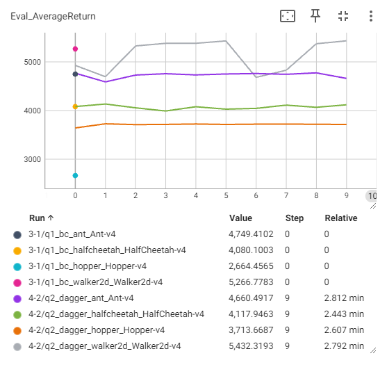
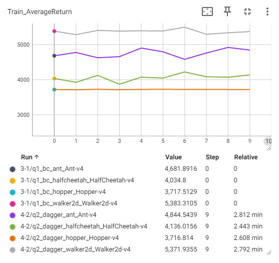

# Homework 1
* Brief [instruction] and [installation] for [Homework1].
* For detailed execution commands, see [run_hw1.ipynb].

## Note
* Implemented algorithms:
  * [x] Behavior Cloning
  * [x] DAgger (Dataset Aggregation)
* I do 3.2 first, do grid search on Ant and select a set of hyperparameters and run on all four tasks with BC and DA. Although the homework       only ask us to choose two of four, I just try all of them.
* Use hyperparameters:
  ```python
  num_agent_train_steps_per_iter = 10000
  train_batch_size = 200
  size = 64
  ```
  `num_agent_train_steps_per_iter = 10000` is a little bit overkill, just for evaluation of all tasks can achieve at least 30% of the             performance of the expert. ：P

## Result
* Learning curves
  * Grid search  
    (x-axis: second)  
    
  * Behavior Cloning vs. DAgger (including the eval of the trained agent vs. the performance of the expert)  
    (x-axis: iteration)  
    <div>
     
     
    </div>
* Evaluation rollouts
  | Behavior Cloning | DAgger            |
  |:----------------:|:-----------------:|
  |![bc_ant]         |![da_ant]          |
  |![bc_halfcheetah] |![da_halfcheetah]  |
  |![bc_hopper]      |![da_hopper]       |
  |![bc_wakler2d]    |![da_wakler2d]     |


[instruction]: instruction.md
[installation]: installation.md
[Homework1]: https://rail.eecs.berkeley.edu/deeprlcourse/deeprlcourse/static/homeworks/hw1.pdf
[run_hw1.ipynb]: cs285/scripts/run_hw1.ipynb
[bc_ant]: results/bc_ant.gif
[bc_halfcheetah]: results/bc_halfcheetah.gif
[bc_hopper]: results/bc_hopper.gif
[bc_wakler2d]: results/bc_wakler2d.gif
[da_ant]: results/da_ant.gif
[da_halfcheetah]: results/da_halfcheetah.gif
[da_hopper]: results/da_hopper.gif
[da_wakler2d]: results/da_wakler2d.gif
