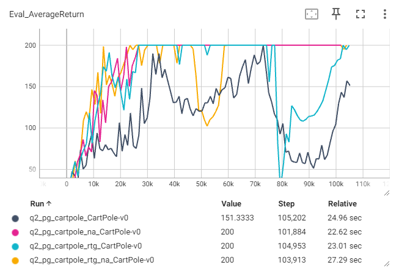
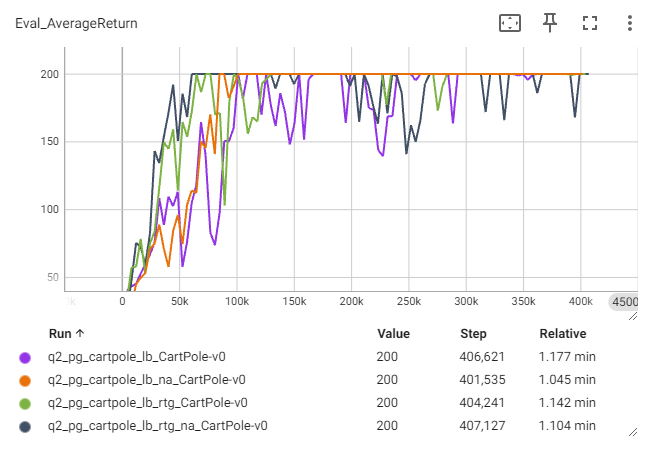

# Homework 2
* Brief [instruction] and [installation] for [Homework2].
* For detailed execution commands, see [run_hw2.ipynb].

## Note
* Implemented algorithms:
  * [x] Policy Gradient (with value function)
  * [x] GAE (Generalized Advantage Estimation)

## Result
* Experiment 1 (CartPole)
  * Learning curves
    * Small Batch vs. Large Batch  
      (x-axis: environment steps)
      

       
       
      

  * Evaluation rollouts  
    (both with rtg & na)
    | small batch      | large batch      |
    |:----------------:|:----------------:|
    |![exp1]           |![exp1_lb]        |
* Experiment 2 (HalfCheetah)
  * Learning curves
    * Without Baseline vs. Baseline
      

       
       
      

    * Comparison of decreased bgs & blr
      

       
       
      

      The default setting of baseline is: `bgs=5, blr=0.01`, i.e., the setting of the light blue and the pink one are the same. The difference is caused by randomness.
    * Without NA vs. NA
      

       
       
      

  * Evaluation rollouts
    | baseline + na    |
    |:----------------:|
    |![exp2]           |
* Experiment 3 (LunarLander)
  * Learning curves
  * Evaluation rollouts
* Experiment 4 (InvertedPendulum)
  * Learning curves
  * Evaluation rollouts
* Experiment 5 (Humanoid)
  * Learning curves
  * Evaluation rollouts

[instruction]: instruction.md
[installation]: installation.md
[Homework2]: https://rail.eecs.berkeley.edu/deeprlcourse/deeprlcourse/static/homeworks/hw2.pdf
[run_hw2.ipynb]: cs285/scripts/run_hw2.ipynb
[exp1]: results/exp1_pg_cartpole_rtg_na.gif
[exp1_lb]: results/exp1_pg_cartpole_lb_rtg_na.gif
[exp2]: results/exp2_pg_cheetah_baseline_na.gif
