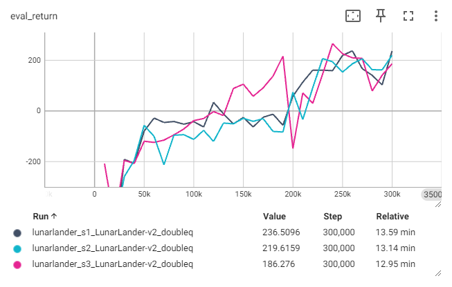

# Homework 3
* [Homework3]
* For detailed execution commands, see [run_hw3_dqn.ipynb] and [run_hw3_sac.ipynb].

## Note
* Implemented algorithms:
  * [x] Q-Learning
  * [x] Double Q-Learning
  * [x] Clipped Double Q-Learning
  * [x] SAC (Soft Actor Critic)
  * [x] REDQ (Randomized Ensembled Double Q-Learning)

## Troubleshooting
Fix two bugs in `MemoryEfficientReplayBuffer`.

## Result
* 2.4 Basic Q-Learning
  * Debug your DQN implementation on CartPole-v1.
  * Run DQN on CartPole-v1, but change the learning rate to 0.05.
    * Learning curves  
      (x-axis: environment steps)  
      
      
      
  * Run DQN with three different seeds on LunarLander-v2.
    * Learning curves  
        
      Q-Learning might be unstable.
    * Evaluation rollouts
      | s1               | s2               | s3                |
      |:----------------:|:----------------:|:-----------------:|
      |![lunarlander_s1] |![lunarlander_s2] |![lunarlander_s3]  |
* 2.5 Double Q-Learning
  * Run three more seeds of the lunar lander problem.
    * Learning curves  
        
      Double Q-Learning shows more stablility.
    * Evaluation rollouts
      | s1                       | s2                       | s3                        |
      |:------------------------:|:------------------------:|:-------------------------:|
      |![doubleq_lunarlander_s1] |![doubleq_lunarlander_s2] |![doubleq_lunarlander_s3]  |
  * Run your DQN implementation on the MsPacman-v0 problem.
    * Learning curves  
      Eval Return vs. Train Return (smoothing: 0.85)  
      
        
      Since the agent tends to take random actions at early stage, the train return and eval return might look very different early in training. (In this training, the difference looks not so different?)
    * Evaluation rollouts  
      ![mspacman]
* 2.6 Experimenting with Hyperparameters  
  I choose `Space Invaders` and run with `learining rate = 1e-3, 5e-3, 1e-4, 5e-4`.  
  * Learning curves  
      
    `lr = 1e-4` works best here.
  * Evaluation rollouts
    | lr = 1e-3              | lr = 5e-3              | 
    |:----------------------:|:----------------------:|
    |![spaceinvaders_lr1e-3] |![spaceinvaders_lr5e-3] |

    | lr = 1e-4              | lr = 5e-4              |
    |:----------------------:|:----------------------:|
    |![spaceinvaders_lr1e-4] |![spaceinvaders_lr5e-4] |

----------------------------------------------------------

* 3.1.1 Bootstrapping
  * (Testing) Hard Update vs. Soft Update  
    
* 3.1.2 Entropy Bonus and Soft Actor-Critic
  * (Testing) Entropy during the critic updates. (smoothing: 0.85)  
    
* 3.1.3 Actor with REINFORCE
  * (Testing) Train an agent on InvertedPendulum-v4 using sanity_invertedpendulum_reinforce.yaml.  
    
  * Train an agent on HalfCheetah-v4 using halfcheetah_reinforce1.yaml.
  * Train another agent with halfcheetah_reinforce10.yaml.  
    (see 3.1.4)
* 3.1.4 Actor with REPARAMETRIZE
  * (Testing) Make sure you can solve InvertedPendulum-v4 using sanity_invertedpendulum_reparametrize.yaml.  
    
  * Train (once again) on HalfCheetah-v4 with halfcheetah_reparametrize.yaml.  
    Comparison of REINFORCE-1, REINFORCE-10 and REPARAMETRIZE  
    
  * Train an agent for the Humanoid-v4 environment with humanoid_sac.yaml.  
    (see 3.1.5)
* 3.1.5 Stabilizing Target Values
  * Run single-Q, double-Q, and clipped double-Q on Hopper-v4.  
    
    
  * Pick the best configuration (single-Q/double-Q/clipped double-Q, or REDQ if you implement it) and run it on Humanoid-v4.  
    I choose `REDQ`.
    * Learning curves  
      Clipped Double-Q vs. REDQ (including Policy Gradient from hw2) (smoothing: 0.85)  
      
      
    * Evaluation rollouts
      | Clipped Double-Q    | REDQ                | 
      |:-------------------:|:-------------------:|
      |![humanoid]          |![humanoid_redq]     |

## Reference
* [Randomized Ensembled Double Q-Learning: Learning Fast Without a Model], X Chen *et al.*

[Homework3]: https://rail.eecs.berkeley.edu/deeprlcourse/deeprlcourse/static/homeworks/hw3.pdf
[run_hw3_dqn.ipynb]: run_hw3_dqn.ipynb
[run_hw3_sac.ipynb]: run_hw3_sac.ipynb
[lunarlander_s1]: results/dqn_lunarlander_s1.gif
[lunarlander_s2]: results/dqn_lunarlander_s2.gif
[lunarlander_s3]: results/dqn_lunarlander_s3.gif
[doubleq_lunarlander_s1]: results/doubleq_lunarlander_s1.gif
[doubleq_lunarlander_s2]: results/doubleq_lunarlander_s2.gif
[doubleq_lunarlander_s3]: results/doubleq_lunarlander_s3.gif
[mspacman]: results/doubleq_mspacman.gif
[spaceinvaders_lr1e-3]: results/doubleq_spaceinvaders_lr1e-3.gif
[spaceinvaders_lr5e-3]: results/doubleq_spaceinvaders_lr5e-3.gif
[spaceinvaders_lr1e-4]: results/doubleq_spaceinvaders_lr1e-4.gif
[spaceinvaders_lr5e-4]: results/doubleq_spaceinvaders_lr1e-4.gif
[humanoid]: results/humanoid.gif
[humanoid_redq]: results/humanoid_redq.gif
[Randomized Ensembled Double Q-Learning: Learning Fast Without a Model]: https://arxiv.org/abs/2101.05982
