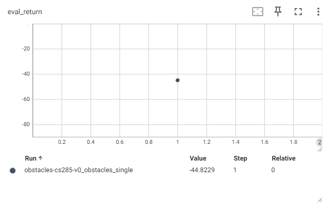
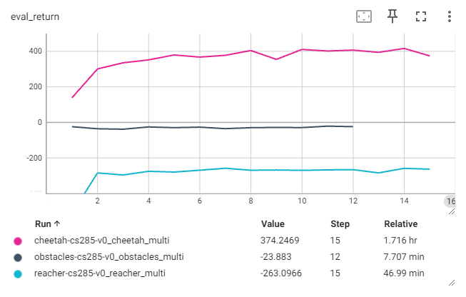
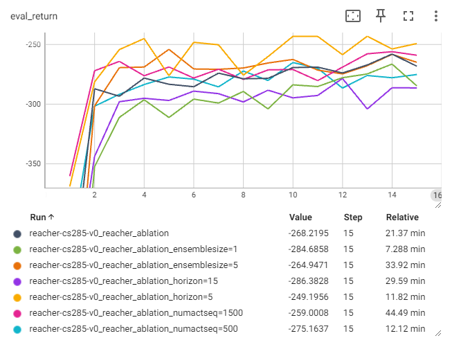
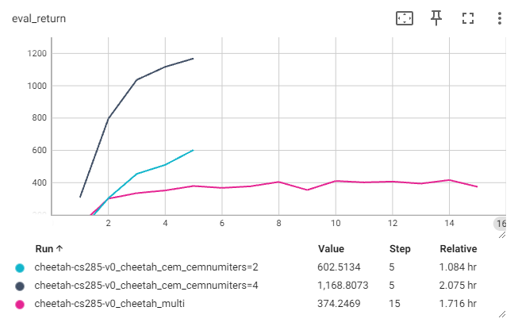
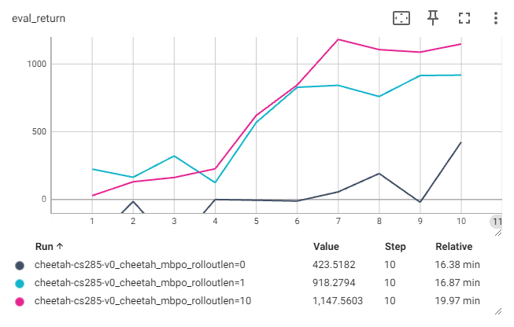

# Homework 4
* [Homework4]
* For detailed execution commands, see [run_hw4.ipynb].

## Note
* Implemented algorithms:
  * [x] MPC (Model Predictive Control)
  * [x] CEM (Cross-Entropy Method)
  * [x] MBPO (Model-Based Policy Optimization)

## Result
* Problem 1  
  The default setting is: `lr = 0.001, num_layers = 1`.
  | default          | lr = 0.01        | numlayers = 3     |
  |:----------------:|:----------------:|:-----------------:|
  |![p1_default]     |![p1_lr]          |![p1_numlayers]    |
* Problem 2  
  (x-axis: iterations)  
  
* Problem 3
  * Learning curves  
    
  * Evaluation rollouts
    | obstacles        |
    |:----------------:|
    |![obstacles]      |
    
    | reacher          |
    |:----------------:|
    |![reacher]        |

    | halfcheetah      |
    |:----------------:|
    |![cheetah]        |
* Problem 4  
  The default setting is:
  ```python
  ensemble_size = 3
  mpc_num_action_sequences = 1000
  mpc_horizon = 10
  ```
  
* Problem 5
  * Learning curves  
    
  * Evaluation rollouts
    | cem_num_iters = 2               | cem_num_iters = 4               |
    |:-------------------------------:|:-------------------------------:|
    |![cheetah_cem_cemnumiters=2]     |![cheetah_cem_cemnumiters=4]     |
* Problem 6
  * Learning curves  
    
  * Evaluation rollouts
    | Model-free SAC baseline mbpo_rollout_length = 0 | Dyna-like algorithm mbpo_rollout_length = 1 | MBPO<br> mbpo_rollout_length = 10 |
    |:-----------------------------------------------:|:-------------------------------------------:|:---------------------------------:|
    |![cheetah_mbpo_rolloutlen=0]                     |![cheetah_mbpo_rolloutlen=1]                 |![cheetah_mbpo_rolloutlen=10]      |

## Reference
* [Neural Network Dynamics for Model-Based Deep Reinforcement Learning with Model-Free Fine-Tuning], A Nagabandi *et al.*
* [Deep Dynamics Models for Learning Dexterous Manipulation], A Nagabandi *et al.*
* [When to Trust Your Model: Model-Based Policy Optimization], M Janner *et al.*


[Homework4]: https://rail.eecs.berkeley.edu/deeprlcourse/deeprlcourse/static/homeworks/hw4.pdf
[run_hw4.ipynb]: run_hw4.ipynb
[p1_default]: results/itr_1_loss_curve.png
[p1_lr]: <results/itr_1_loss_curve lr=0.01.png>
[p1_numlayers]: <results/itr_1_loss_curve numlayers=3.png>
[obstacles]: results/obstacles_multi.gif
[reacher]: results/reacher_multi.gif
[cheetah]: results/cheetah_multi.gif
[cheetah_cem_cemnumiters=2]: results/cheetah_cem_cemnumiters=2.gif
[cheetah_cem_cemnumiters=4]: results/cheetah_cem_cemnumiters=4.gif
[cheetah_mbpo_rolloutlen=0]: results/cheetah_mbpo_rolloutlen=0.gif
[cheetah_mbpo_rolloutlen=1]: results/cheetah_mbpo_rolloutlen=1.gif
[cheetah_mbpo_rolloutlen=10]: results/cheetah_mbpo_rolloutlen=10.gif
[Neural Network Dynamics for Model-Based Deep Reinforcement Learning with Model-Free Fine-Tuning]: https://arxiv.org/pdf/1708.02596
[Deep Dynamics Models for Learning Dexterous Manipulation]: https://arxiv.org/pdf/1909.11652
[When to Trust Your Model: Model-Based Policy Optimization]: https://arxiv.org/pdf/1906.08253
