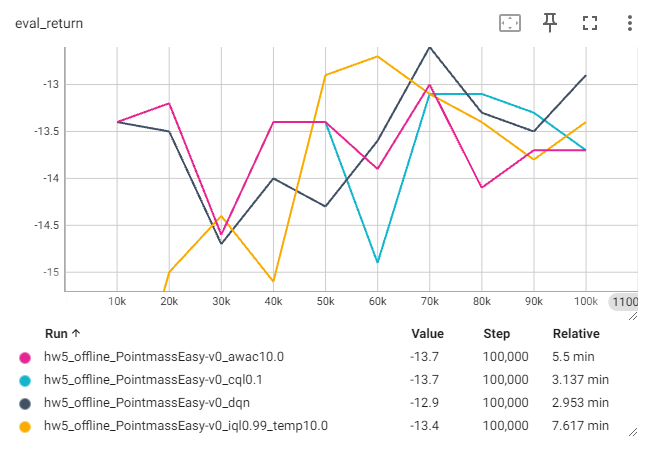
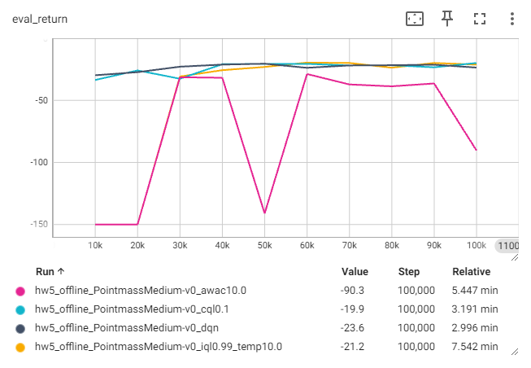
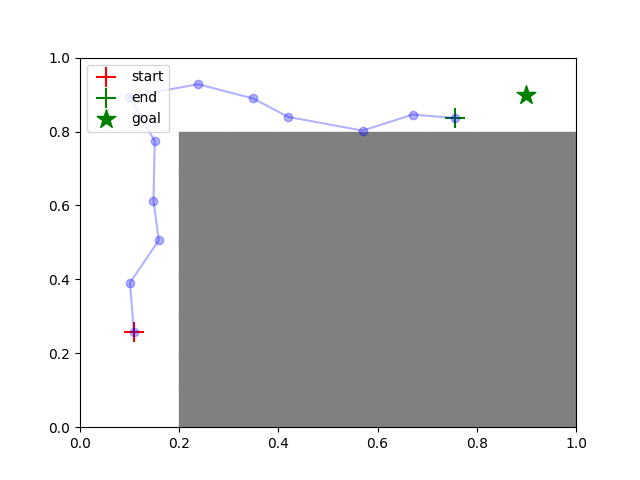
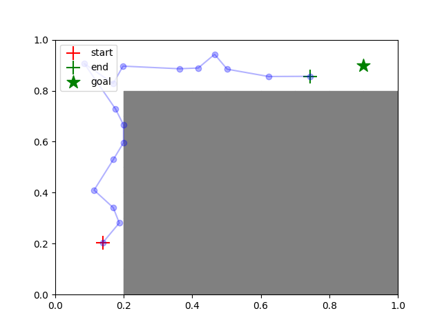
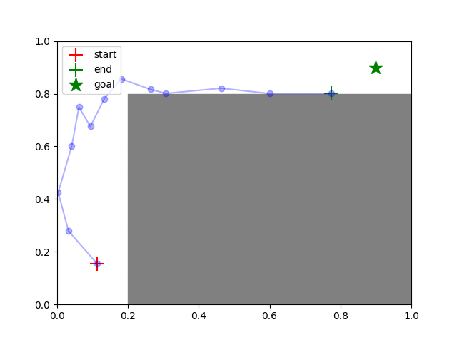
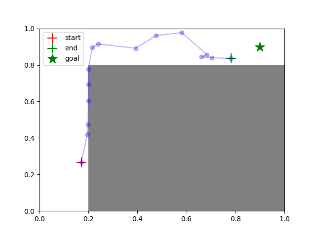

# Homework 5
* [Homework5]
* For detailed execution commands, see [run_hw5.ipynb].

## Note
* Implemented algorithms:
  * [x] 
  * [x] 
  * [x] 
  * [x] 
  * [x] 

## Troubleshooting
In `run_hw5_finetune.py`, use normal rewards when updating the agent: remove `* (1 if config.get("use_reward", False) else 0)`. I had tried `use_reward` flag, didn't work...

## Result
### 3 Exploration
|                  | Easy             | Medium           | Hard             |
|:-----------------|:----------------:|:----------------:|:----------------:|
| Random           |![random_easy]    |![random_medium]  |![random_hard]    |
| RND              |![rnd_easy]       |![rnd_medium]     |![rnd_hard]       |

### 4 Offline RL
* 4.1 CQL
  * Run DQN and CQL on Easy and Medium.  
    (see 4.2)
  * On the Medium environment, create several experiment variations in which the value of the α parameter is varied, from α = 0 (equivalent to DQN) to α = 10.  
    I try `α = 0.01, 1, 5, 10`. (default α = 0.1)
    * Learning curves  
      (x-axis: environment steps)  
      
      
    * Evaluation rollouts  
      (click pictures to see all evalutions)
      | α = 0.01                               | α = 1                                  | α = 5                                  | α = 10                                 |
      |:--------------------------------------:|:--------------------------------------:|:--------------------------------------:|:--------------------------------------:|
      |[![off_med_cql0.01_0]][off_med_cql0.01] |[![off_med_cql1.0_0]][off_med_cql1.0]   |[![off_med_cql5.0_0]][off_med_cql5.0]   |[![off_med_cql10.0_0]][off_med_cql10.0] |
* 4.2 Policy Constraint Methods: IQL and AWAC
  * Learning curves  
    Comparison of DQN, CQL, AWAC and IQL
    * Easy  
      
    * Medium  
      
  * Evaluation rollouts
    
    <table>
      <thead>
        <tr>
          <td>DQN</td>
          <td>CQL</td>
          <td>AWAC</td>
          <td>IQL</td>
        </tr>
      </thead>
      <tbody>
        <tr>
           <td></td>
           <td></td>
           <td></td>
           <td></td>
        </tr>
      </tbody>
    </table>
    
    * Easy
      | DQN                              | CQL                                  | AWAC                                  | IQL                                |
      |:--------------------------------------:|:--------------------------------------:|:--------------------------------------:|:--------------------------------------:|
      |[![off_easy_dqn_0]][off_easy_dqn] |[![off_easy_cql0.1_0]][off_easy_cql0.1]   |[![off_easy_awac10.0_0]][off_easy_awac10.0]   |[![off_easy_iql0.99_0]][off_easy_iql0.99] |
    * Medium
      | DQN                                | CQL                                 | AWAC                                  | IQL                                 |
      |:--------------------------------------:|:--------------------------------------:|:--------------------------------------:|:--------------------------------------:|
      |[!] |[![off_med_cql1.0_0]][off_med_cql1.0]   |[![off_med_cql5.0_0]][off_med_cql5.0]   |[![off_med_cql10.0_0]][off_med_cql10.0] |
* 4.3 Data Ablations
  I run on Hard.
  * Exploration (with RND)
  * Learning curves
  * Evalution rollouts

### 5 Online Fine-Tuning
I run DQN, CQL, AWAC and IQL on Hard, and compare offline training and online finetuning.
* Learning curves
* Evaluation rollouts

### Bonus Problem

## Reference

[Homework5]: https://rail.eecs.berkeley.edu/deeprlcourse/deeprlcourse/static/homeworks/hw5.pdf
[run_hw5.ipynb]: run_hw5.ipynb
[random_easy]: exploration_visualization/PointmassEasy-v0_random.png
[random_medium]: exploration_visualization/PointmassMedium-v0_random.png
[random_hard]: exploration_visualization/PointmassHard-v0_random.png
[rnd_easy]: exploration_visualization/PointmassEasy-v0_rnd1.0.png
[rnd_medium]: exploration_visualization/PointmassMedium-v0_rnd1.0.png
[rnd_hard]: exploration_visualization/PointmassHard-v0_rnd1.0.png

[off_med_cql0.01_0]: results/offline_medium_cql0.01_0.png
[off_med_cql1.0_0]: results/offline_medium_cql1.0_0.png
[off_med_cql5.0_0]: results/offline_medium_cql5.0_0.png
[off_med_cql10.0_0]: results/offline_medium_cql10.0_0.png
[off_med_cql0.01]: results/offline_medium_cql0.01.png
[off_med_cql1.0]: results/offline_medium_cql1.0.png
[off_med_cql5.0]: results/offline_medium_cql5.0.png
[off_med_cql10.0]: results/offline_medium_cql10.0.png

[off_easy_dqn_0]: results/offline_easy_dqn_0.png
[off_easy_cql0.1_0]: results/offline_easy_cql0.1_0.png
[off_easy_awac10.0_0]: results/offline_easy_awac10.0_0.png
[off_easy_iql0.99_0]: results/offline_easy_iql0.99_temp10.0_0.png
[off_easy_dqn]: results/offline_easy_dqn.png
[off_easy_cql0.1]: results/offline_easy_cql0.1.png
[off_easy_awac10.0]: results/offline_easy_awac10.0.png
[off_easy_iql0.99]: results/offline_easy_iql0.99_temp10.0.png

[off_med_dqn_0]: results/offline_medium_dqn_0.png
[off_med_cql0.1_0]: results/offline_medium_cql0.1_0.png
[off_med_awac10.0_0]: results/offline_medium_awac10.0_0.png
[off_med_iql0.99_0]: results/offline_medium_iql0.99_temp10.0_0.png
[off_med_dqn]: results/offline_medium_dqn.png
[off_med_cql0.1]: results/offline_medium_cql0.1.png
[off_med_awac10.0]: results/offline_medium_awac10.0.png
[off_med_iql0.99]: results/offline_medium_iql0.99_temp10.0.png
