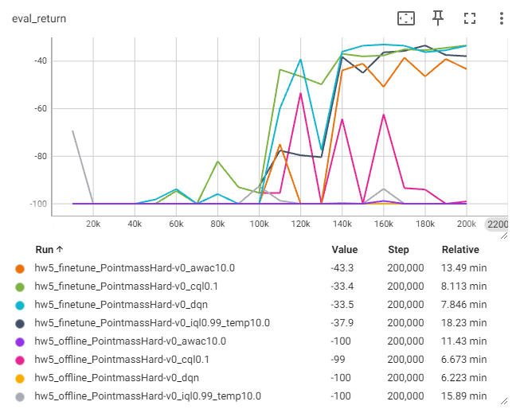

# Homework 5
* [Homework5]
* For detailed execution commands, see [run_hw5.ipynb].

## Note
* Implemented algorithms:
  * [x] Random Network Distillation (RND)
  * [x] Conservative Q-Learning (CQL) 
  * [x] Advantage Weighted Actor Critic (AWAC)
  * [x] Implicit Q-Learning (IQL)

## Troubleshooting
In `run_hw5_finetune.py`, use normal rewards when updating the agent: remove `* (1 if config.get("use_reward", False) else 0)`. I tried `use_reward` flag but it didn't work.

## Result
### 3 Exploration
```python
total_steps = 10000
```
|                  | Easy             | Medium           | Hard             |
|:-----------------|:----------------:|:----------------:|:----------------:|
| Random           |![random_easy]    |![random_medium]  |![random_hard]    |
| RND              |![rnd_easy]       |![rnd_medium]     |![rnd_hard]       |

### 4 Offline RL
* 4.1 CQL
  * Run DQN and CQL on Easy and Medium environment.  
    (see 4.2)
  * On the Medium environment, create several experiment variations in which the value of the α parameter is varied, from α = 0 (equivalent to DQN) to α = 10.  
    I try `α = 0.01, 1, 5, 10`. (default α = 0.1)
    * Learning curves  
      (x-axis: environment steps)  
      
      
    * Evaluation rollouts  
      **(click pictures to see all evaluations)**
      | α = 0.01                               | α = 1                                  | α = 5                                  | α = 10                                 |
      |:--------------------------------------:|:--------------------------------------:|:--------------------------------------:|:--------------------------------------:|
      |[![off_med_cql0.01_0]][off_med_cql0.01] |[![off_med_cql1.0_0]][off_med_cql1.0]   |[![off_med_cql5.0_0]][off_med_cql5.0]   |[![off_med_cql10.0_0]][off_med_cql10.0] |
* 4.2 Policy Constraint Methods: IQL and AWAC
  * Learning curves  
    Comparison of DQN, CQL, AWAC and IQL
    * Easy  
      
    * Medium  
      
  * Evaluation rollouts    
    * Easy
      | DQN                              | CQL                                    | AWAC                                       | IQL                                      |
      |:--------------------------------:|:--------------------------------------:|:------------------------------------------:|:----------------------------------------:|
      |[![off_easy_dqn_0]][off_easy_dqn] |[![off_easy_cql0.1_0]][off_easy_cql0.1] |[![off_easy_awac10.0_0]][off_easy_awac10.0] |[![off_easy_iql0.99_0]][off_easy_iql0.99] |
    * Medium
      | DQN                              | CQL                                    | AWAC                                       | IQL                                      |
      |:--------------------------------:|:--------------------------------------:|:------------------------------------------:|:----------------------------------------:|
      |[![off_med_dqn_0]][off_med_dqn]   |[![off_med_cql0.1_0]][off_med_cql0.1]   |[![off_med_awac10.0_0]][off_med_awac10.0]   |[![off_med_iql0.99_0]][off_med_iql0.99]   |
* 4.3 Data Ablations  
  I run on Hard environment.
  * Exploration (with RND)
    | total_steps = 1000      | total_steps = 5000      | total_steps = 10000     | total_steps = 20000     |
    |:-----------------------:|:-----------------------:|:-----------------------:|:-----------------------:|
    |![4-3_totalsteps=1000]   |![4-3_totalsteps=5000]   |![4-3_totalsteps=10000]  |![4-3_totalsteps=20000]  |
  * Learning curves  
      
    When the maze becomes difficult, the agent struggles to reach the goal with only offline training. By using a larger dataset, the situation can be improved though...
  * Evalution rollouts  
    (It's total_steps of exploration, i.e., the size of the dataset.)
    | total_steps = 1000      | total_steps = 5000      | total_steps = 10000     | total_steps = 20000     |
    |:-----------------------:|:-----------------------:|:-----------------------:|:-----------------------:|
    |[![off_hard_cql_1000_0]][off_hard_cql_1000] |[![off_hard_cql_5000_0]][off_hard_cql_5000] |[![off_hard_cql_10000_0]][off_hard_cql_10000] |[![off_hard_cql_20000_0]][off_hard_cql_20000] |
    
### 5 Online Fine-Tuning
I run DQN, CQL, AWAC and IQL on Hard environment, and compare offline training and online finetuning.
* Learning curves  
  Offline Training vs. Online Finetuning (including comparison of DQN, CQL, AWAC and IQL)  
    
  With online finetuning, the performance can be further improved.
* Evaluation rollouts
  |                   | DQN               | CQL               | AWAC              | IQL               |
  |:------------------|:-----------------:|:-----------------:|:-----------------:|:-----------------:|
  | offline training  |[![off_hard_dqn_0]][off_hard_dqn] |[![off_hard_cql0.1_0]][off_hard_cql0.1] |[![off_hard_awac10.0_0]][off_hard_awac10.0] |[![off_hard_iql0.99_0]][off_hard_iql0.99] |
  | online finetuning |[![on_hard_dqn_0]][on_hard_dqn]   |[![on_hard_cql0.1_0]][on_hard_cql0.1]   |[![on_hard_awac10.0_0]][on_hard_awac10.0]   |[![on_hard_iql0.99_0]][on_hard_iql0.99]   |
* Last 10000 steps during finetune training
  | DQN                    | CQL                    | AWAC                   | IQL                    |
  |:----------------------:|:----------------------:|:----------------------:|:----------------------:|
  |![last_traj_hard_dqn]   |![last_traj_hard_cql]   |![last_traj_hard_awac]  |![last_traj_hard_iql]   |
  
### Bonus Problem
I also try extra mazes. ：）
| Fly Trap Small         | Tree                   | Fly Trap Big           | Galton                 |
|:----------------------:|:----------------------:|:----------------------:|:----------------------:|
|[![on_flytrapsmall_iql_0]][on_flytrapsmall_iql] |[![on_tree_iql_0]][on_tree_iql] |[![on_flytrapbig_iql_0]][on_flytrapbig_iql] |[![on_galton_iql_0]][on_galton_iql] |

| Spiral 11x11           | Maze 11x11             | U Multi                | Tunnel                 |
|:----------------------:|:----------------------:|:----------------------:|:----------------------:|
|[![on_spiral11x11_iql_0]][on_spiral11x11_iql] |[![on_maze11x11_iql_0]][on_maze11x11_iql] |[![on_umulti_iql_0]][on_umulti_iql] |[![on_tunnel_iql_0]][on_tunnel_iql] |

For detailed results, see [here].

## Reference
* [Exploration by Random Network Distillation], Y Burda *et al.*
* [Conservative Q-Learning for Offline Reinforcement Learning], A Kumar *et al.*
* [AWAC: Accelerating Online Reinforcement Learning with Offline Datasets], A Nair *et al.*
* [Offline Reinforcement Learning with Implicit Q-Learning], I Kostrikov *et al.*


[Homework5]: https://rail.eecs.berkeley.edu/deeprlcourse/deeprlcourse/static/homeworks/hw5.pdf
[run_hw5.ipynb]: run_hw5.ipynb
[random_easy]: exploration_visualization/PointmassEasy-v0_random.png
[random_medium]: exploration_visualization/PointmassMedium-v0_random.png
[random_hard]: exploration_visualization/PointmassHard-v0_random.png
[rnd_easy]: exploration_visualization/PointmassEasy-v0_rnd1.0.png
[rnd_medium]: exploration_visualization/PointmassMedium-v0_rnd1.0.png
[rnd_hard]: exploration_visualization/PointmassHard-v0_rnd1.0.png

[off_med_cql0.01_0]: results/offline_medium_cql0.01_0.png
[off_med_cql1.0_0]: results/offline_medium_cql1.0_0.png
[off_med_cql5.0_0]: results/offline_medium_cql5.0_0.png
[off_med_cql10.0_0]: results/offline_medium_cql10.0_0.png
[off_med_cql0.01]: results/offline_medium_cql0.01.png
[off_med_cql1.0]: results/offline_medium_cql1.0.png
[off_med_cql5.0]: results/offline_medium_cql5.0.png
[off_med_cql10.0]: results/offline_medium_cql10.0.png

[off_easy_dqn_0]: results/offline_easy_dqn_0.png
[off_easy_cql0.1_0]: results/offline_easy_cql0.1_0.png
[off_easy_awac10.0_0]: results/offline_easy_awac10.0_0.png
[off_easy_iql0.99_0]: results/offline_easy_iql0.99_temp10.0_0.png
[off_easy_dqn]: results/offline_easy_dqn.png
[off_easy_cql0.1]: results/offline_easy_cql0.1.png
[off_easy_awac10.0]: results/offline_easy_awac10.0.png
[off_easy_iql0.99]: results/offline_easy_iql0.99_temp10.0.png

[off_med_dqn_0]: results/offline_medium_dqn_0.png
[off_med_cql0.1_0]: results/offline_medium_cql0.1_0.png
[off_med_awac10.0_0]: results/offline_medium_awac10.0_0.png
[off_med_iql0.99_0]: results/offline_medium_iql0.99_temp10.0_0.png
[off_med_dqn]: results/offline_medium_dqn.png
[off_med_cql0.1]: results/offline_medium_cql0.1.png
[off_med_awac10.0]: results/offline_medium_awac10.0.png
[off_med_iql0.99]: results/offline_medium_iql0.99_temp10.0.png

[4-3_totalsteps=1000]: exploration_visualization/PointmassHard-v0_rnd1.0_totalsteps=1000.png
[4-3_totalsteps=5000]: exploration_visualization/PointmassHard-v0_rnd1.0_totalsteps=5000.png
[4-3_totalsteps=10000]: exploration_visualization/PointmassHard-v0_rnd1.0_totalsteps=10000.png
[4-3_totalsteps=20000]: exploration_visualization/PointmassHard-v0_rnd1.0_totalsteps=20000.png
[off_hard_cql_1000_0]: results/offline_hard_cql0.1_exploresteps=1000_0.png
[off_hard_cql_5000_0]: results/offline_hard_cql0.1_exploresteps=5000_0.png
[off_hard_cql_10000_0]: results/offline_hard_cql0.1_exploresteps=10000_0.png
[off_hard_cql_20000_0]: results/offline_hard_cql0.1_exploresteps=20000_0.png
[off_hard_cql_1000]: results/offline_hard_cql0.1_exploresteps=1000.png
[off_hard_cql_5000]: results/offline_hard_cql0.1_exploresteps=5000.png
[off_hard_cql_10000]: results/offline_hard_cql0.1_exploresteps=10000.png
[off_hard_cql_20000]: results/offline_hard_cql0.1_exploresteps=20000.png

[off_hard_dqn_0]: results/offline_hard_dqn_0.png
[off_hard_cql0.1_0]: results/offline_hard_cql0.1_0.png
[off_hard_awac10.0_0]: results/offline_hard_awac10.0_0.png
[off_hard_iql0.99_0]: results/offline_hard_iql0.99_temp10.0_0.png
[off_hard_dqn]: results/offline_hard_dqn.png
[off_hard_cql0.1]: results/offline_hard_cql0.1.png
[off_hard_awac10.0]: results/offline_hard_awac10.0.png
[off_hard_iql0.99]: results/offline_hard_iql0.99_temp10.0.png

[on_hard_dqn_0]: results/finetune_hard_dqn_0.png
[on_hard_cql0.1_0]: results/finetune_hard_cql0.1_0.png
[on_hard_awac10.0_0]: results/finetune_hard_awac10.0_0.png
[on_hard_iql0.99_0]: results/finetune_hard_iql0.99_temp10.0_0.png
[on_hard_dqn]: results/finetune_hard_dqn.png
[on_hard_cql0.1]: results/finetune_hard_cql0.1.png
[on_hard_awac10.0]: results/finetune_hard_awac10.0.png
[on_hard_iql0.99]: results/finetune_hard_iql0.99_temp10.0.png
[last_traj_hard_dqn]: exploration_visualization/finetune_PointmassHard-v0_dqn.png
[last_traj_hard_cql]: exploration_visualization/finetune_PointmassHard-v0_cql0.1.png
[last_traj_hard_awac]: exploration_visualization/finetune_PointmassHard-v0_awac10.0.png
[last_traj_hard_iql]: exploration_visualization/finetune_PointmassHard-v0_iql0.99_temp10.0.png

[on_flytrapsmall_iql_0]: results/finetune_veryhard-flytrapsmall_iql0.99_temp10.0_0.png
[on_flytrapbig_iql_0]: results/finetune_veryhard-flytrapbig_iql0.99_temp10.0_0.png
[on_tree_iql_0]: results/finetune_veryhard-tree_iql0.99_temp10.0_0.png
[on_galton_iql_0]: results/finetune_veryhard-galton_iql0.99_temp10.0_0.png
[on_spiral11x11_iql_0]: results/finetune_veryhard-spiral11x11_iql0.99_temp10.0_0.png
[on_maze11x11_iql_0]: <results/finetune_veryhard-maze11x11_iql0.99_temp10.0 (510k)_0.png>
[on_umulti_iql_0]: <results/finetune_veryhard-umulti_iql0.99_temp10.0 (950k)_0.png>
[on_tunnel_iql_0]: results/finetune_veryhard-tunnel_iql0.99_temp10.0_0.png

[on_flytrapsmall_iql]: results/finetune_veryhard-flytrapsmall_iql0.99_temp10.0.png
[on_flytrapbig_iql]: results/finetune_veryhard-flytrapbig_iql0.99_temp10.0.png
[on_tree_iql]: results/finetune_veryhard-tree_iql0.99_temp10.0.png
[on_galton_iql]: results/finetune_veryhard-galton_iql0.99_temp10.0.png
[on_spiral11x11_iql]: results/finetune_veryhard-spiral11x11_iql0.99_temp10.0.png
[on_maze11x11_iql]: <results/finetune_veryhard-maze11x11_iql0.99_temp10.0 (510k).png>
[on_umulti_iql]: <results/finetune_veryhard-umulti_iql0.99_temp10.0 (950k).png>
[on_tunnel_iql]: results/finetune_veryhard-tunnel_iql0.99_temp10.0.png
[here]: extra_mazes.md

[Exploration by Random Network Distillation]: https://arxiv.org/abs/1810.12894
[Conservative Q-Learning for Offline Reinforcement Learning]: https://arxiv.org/abs/2006.04779
[AWAC: Accelerating Online Reinforcement Learning with Offline Datasets]: https://arxiv.org/abs/2006.09359
[Offline Reinforcement Learning with Implicit Q-Learning]: https://arxiv.org/abs/2110.06169
