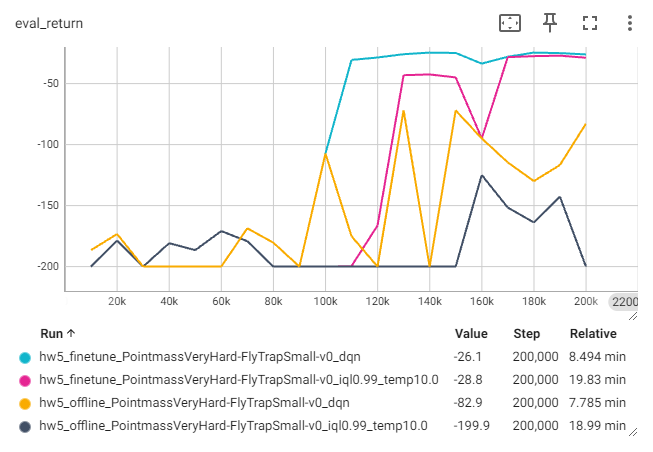
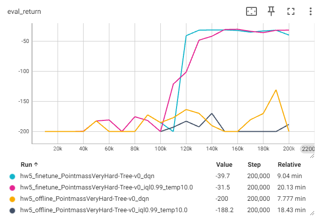
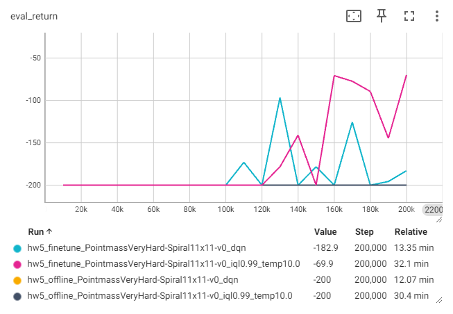
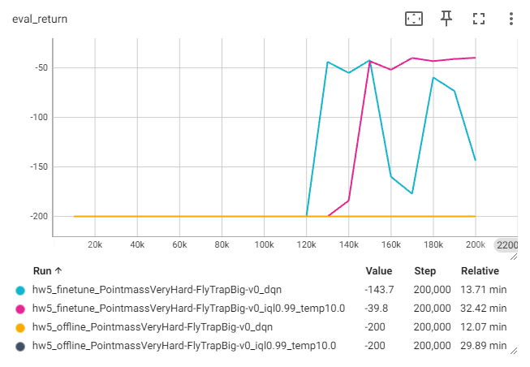
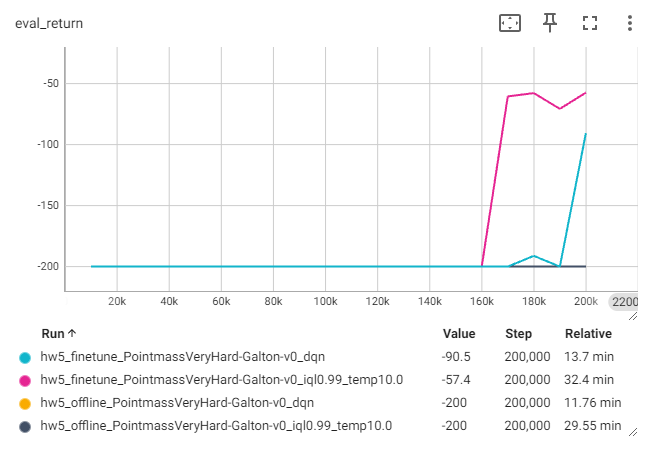
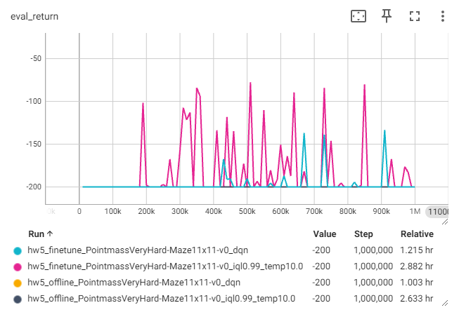
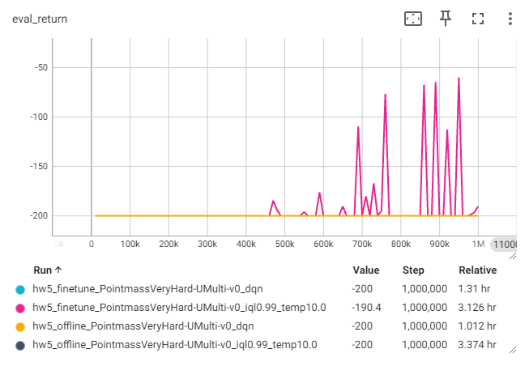
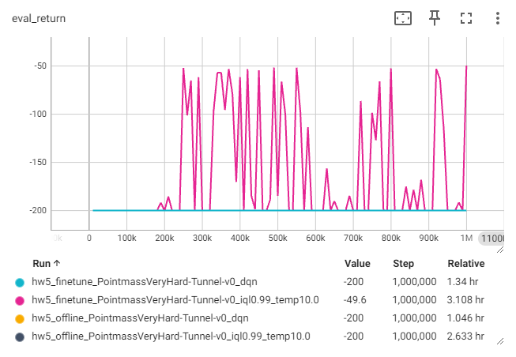

## Bonus Problem
* I try extra mazes which are: `'FlyTrapSmall', 'Tree', 'Spiral11x11', 'FlyTrapBig', 'Galton', 'Maze11x11', 'UMulti', 'Tunnel'`.
* I finetune `IQL` on these mazes and by results divide them into 3 groups, each has a set of hyperparameters. I also run `DQN` for comparison.
* Mazes in the 3rd group are more complex and the randomness is fixed in this homework, so the agent might not perform well at the last evaluation,
  so I train it longer and pick some good evaluations over the training.
* I had also finetuned CQL and AWAC on these mazes, some results look good and some need more finetuning;
  since there are too many hyperparameters and I had already spent too much time on this, I decided to stop here.
* Try it and have fun. :blush:  

### Exploration
```python
total_steps = 20000
```
* Exploration (RND) / Last 20000 steps during finetune training of DQN & IQL
  |                     | RND                 | DQN                 | IQL                 |
  |:--------------------|:-------------------:|:-------------------:|:-------------------:|
  | FlyTrapSmall        |![rnd_flytrapsmall]  |![dqn_flytrapsmall]  |![iql_flytrapsmall]  |
  | Tree                |![rnd_tree]          |![dqn_tree]          |![iql_tree]          |
  | Spiral11x11         |![rnd_spiral11x11]   |![dqn_spiral11x11]   |![iql_spiral11x11]   |
  | FlyTrapBig          |![rnd_flytrapbig]    |![dqn_flytrapbig]    |![iql_flytrapbig]    |
  | Galton              |![rnd_galton]        |![dqn_galton]        |![iql_galton]        |
  | Maze11x11           |![rnd_maze11x11]     |![dqn_maze11x11]     |![iql_maze11x11]     |
  | UMulti              |![rnd_umulti]        |![dqn_umulti]        |![iql_umulti]        |
  | Tunnel              |![rnd_tunnel]        |![dqn_tunnel]        |![iql_tunnel]        |

  If training succeeds, a path from the start to the goal would be emerged from trajectories of the agent.
  
### Group1
```python
mazes1 = ['FlyTrapSmall', 'Tree']
```
* Learning curves  
  Offline Training vs. Online Finetuning (including  DQN vs. IQL)  
  
  
* Evaluation rollouts
  | offline training DQN             | offline training IQL             | online finetuning DQN          | online finetuning IQL          |
  |:--------------------------------:|:--------------------------------:|:------------------------------:|:------------------------------:|
  |[![off_flytrapsmall_dqn_0]][off_flytrapsmall_dqn] |[![off_flytrapsmall_iql_0]][off_flytrapsmall_iql] |[![on_flytrapsmall_dqn_0]][on_flytrapsmall_dqn] |[![on_flytrapsmall_iql_0]][on_flytrapsmall_iql] |
  |[![off_tree_dqn_0]][off_tree_dqn] |[![off_tree_iql_0]][off_tree_iql] |[![on_tree_dqn_0]][on_tree_dqn] |[![on_tree_iql_0]][on_tree_iql] |

### Group2
```python
mazes2 = ['Spiral11x11', 'FlyTrapBig', 'Galton']
```
* Learning curves  
  
  
  
* Evaluation rollouts
  | offline training DQN             | offline training IQL             | online finetuning DQN          | online finetuning IQL          |
  |:--------------------------------:|:--------------------------------:|:------------------------------:|:------------------------------:|
  |[![off_spiral11x11_dqn_0]][off_spiral11x11_dqn] |[![off_spiral11x11_iql_0]][off_spiral11x11_iql] |[![on_spiral11x11_dqn_0]][on_spiral11x11_dqn] |[![on_spiral11x11_iql_0]][on_spiral11x11_iql] |
  |[![off_flytrapbig_dqn_0]][off_flytrapbig_dqn] |[![off_flytrapbig_iql_0]][off_flytrapbig_iql] |[![on_flytrapbig_dqn_0]][on_flytrapbig_dqn] |[![on_flytrapbig_iql_0]][on_flytrapbig_iql] |
  |[![off_galton_dqn_0]][off_galton_dqn] |[![off_galton_iql_0]][off_galton_iql] |[![on_galton_dqn_0]][on_galton_dqn] |[![on_galton_iql_0]][on_galton_iql] |

### Group3
```python
mazes3 = ['Maze11x11', 'UMulti', 'Tunnel']
```
* Learning curves  
  
  
  
* Evaluation rollouts
  | offline training DQN             | offline training IQL             | online finetuning DQN          | online finetuning IQL          |
  |:--------------------------------:|:--------------------------------:|:------------------------------:|:------------------------------:|
  |[![off_maze11x11_dqn_0]][off_maze11x11_dqn] |[![off_maze11x11_iql_0]][off_maze11x11_iql] |[![on_maze11x11_dqn_0]][on_maze11x11_dqn] |[![on_maze11x11_iql_0]][on_maze11x11_iql] |
  |[![off_umulti_dqn_0]][off_umulti_dqn] |[![off_umulti_iql_0]][off_umulti_iql] |[![on_umulti_dqn_0]][on_umulti_dqn] |[![on_umulti_iql_0]][on_umulti_iql] |
  |[![off_tunnel_dqn_0]][off_tunnel_dqn] |[![off_tunnel_iql_0]][off_tunnel_iql] |[![on_tunnel_dqn_0]][on_tunnel_dqn] |[![on_tunnel_iql_0]][on_tunnel_iql] |


[rnd_flytrapsmall]: exploration_visualization/PointmassVeryHard-FlyTrapSmall-v0_rnd1.0.png
[rnd_tree]: exploration_visualization/PointmassVeryHard-Tree-v0_rnd1.0.png
[rnd_spiral11x11]: exploration_visualization/PointmassVeryHard-Spiral11x11-v0_rnd1.0.png
[rnd_flytrapbig]: exploration_visualization/PointmassVeryHard-FlyTrapBig-v0_rnd1.0.png
[rnd_galton]: exploration_visualization/PointmassVeryHard-Galton-v0_rnd1.0.png
[rnd_maze11x11]: exploration_visualization/PointmassVeryHard-Maze11x11-v0_rnd1.0.png
[rnd_umulti]: exploration_visualization/PointmassVeryHard-UMulti-v0_rnd1.0.png
[rnd_tunnel]: exploration_visualization/PointmassVeryHard-Tunnel-v0_rnd1.0.png

[dqn_flytrapsmall]: exploration_visualization/finetune_PointmassVeryHard-FlyTrapSmall-v0_dqn.png
[dqn_tree]: exploration_visualization/finetune_PointmassVeryHard-Tree-v0_dqn.png
[dqn_spiral11x11]: exploration_visualization/finetune_PointmassVeryHard-Spiral11x11-v0_dqn.png
[dqn_flytrapbig]: exploration_visualization/finetune_PointmassVeryHard-FlyTrapBig-v0_dqn.png
[dqn_galton]: exploration_visualization/finetune_PointmassVeryHard-Galton-v0_dqn.png
[dqn_maze11x11]: exploration_visualization/finetune_PointmassVeryHard-Maze11x11-v0_dqn.png
[dqn_umulti]: exploration_visualization/finetune_PointmassVeryHard-UMulti-v0_dqn.png
[dqn_tunnel]: exploration_visualization/finetune_PointmassVeryHard-Tunnel-v0_dqn.png

[iql_flytrapsmall]: exploration_visualization/finetune_PointmassVeryHard-FlyTrapSmall-v0_iql0.99_temp10.0.png
[iql_tree]: exploration_visualization/finetune_PointmassVeryHard-Tree-v0_iql0.99_temp10.0.png
[iql_spiral11x11]: exploration_visualization/finetune_PointmassVeryHard-Spiral11x11-v0_iql0.99_temp10.0.png
[iql_flytrapbig]: exploration_visualization/finetune_PointmassVeryHard-FlyTrapBig-v0_iql0.99_temp10.0.png
[iql_galton]: exploration_visualization/finetune_PointmassVeryHard-Galton-v0_iql0.99_temp10.0.png
[iql_maze11x11]: exploration_visualization/finetune_PointmassVeryHard-Maze11x11-v0_iql0.99_temp10.0.png
[iql_umulti]: exploration_visualization/finetune_PointmassVeryHard-UMulti-v0_iql0.99_temp10.0.png
[iql_tunnel]: exploration_visualization/finetune_PointmassVeryHard-Tunnel-v0_iql0.99_temp10.0.png

[off_flytrapsmall_dqn_0]: results/offline_veryhard-flytrapsmall_dqn_0.png
[off_flytrapbig_dqn_0]: results/offline_veryhard-flytrapbig_dqn_0.png
[off_tree_dqn_0]: results/offline_veryhard-tree_dqn_0.png
[off_galton_dqn_0]: results/offline_veryhard-galton_dqn_0.png
[off_spiral11x11_dqn_0]: results/offline_veryhard-spiral11x11_dqn_0.png
[off_maze11x11_dqn_0]: results/offline_veryhard-maze11x11_dqn_0.png
[off_umulti_dqn_0]: results/offline_veryhard-umulti_dqn_0.png
[off_tunnel_dqn_0]: results/offline_veryhard-tunnel_dqn_0.png

[off_flytrapsmall_dqn]: results/offline_veryhard-flytrapsmall_dqn.png
[off_flytrapbig_dqn]: results/offline_veryhard-flytrapbig_dqn.png
[off_tree_dqn]: results/offline_veryhard-tree_dqn.png
[off_galton_dqn]: results/offline_veryhard-galton_dqn.png
[off_spiral11x11_dqn]: results/offline_veryhard-spiral11x11_dqn.png
[off_maze11x11_dqn]: results/offline_veryhard-maze11x11_dqn.png
[off_umulti_dqn]: results/offline_veryhard-umulti_dqn.png
[off_tunnel_dqn]: results/offline_veryhard-tunnel_dqn.png

[off_flytrapsmall_iql_0]: results/offline_veryhard-flytrapsmall_iql0.99_temp10.0_0.png
[off_flytrapbig_iql_0]: results/offline_veryhard-flytrapbig_iql0.99_temp10.0_0.png
[off_tree_iql_0]: results/offline_veryhard-tree_iql0.99_temp10.0_0.png
[off_galton_iql_0]: results/offline_veryhard-galton_iql0.99_temp10.0_0.png
[off_spiral11x11_iql_0]: results/offline_veryhard-spiral11x11_iql0.99_temp10.0_0.png
[off_maze11x11_iql_0]: results/offline_veryhard-maze11x11_iql0.99_temp10.0_0.png
[off_umulti_iql_0]: results/offline_veryhard-umulti_iql0.99_temp10.0_0.png
[off_tunnel_iql_0]: results/offline_veryhard-tunnel_iql0.99_temp10.0_0.png

[off_flytrapsmall_iql]: results/offline_veryhard-flytrapsmall_iql0.99_temp10.0.png
[off_flytrapbig_iql]: results/offline_veryhard-flytrapbig_iql0.99_temp10.0.png
[off_tree_iql]: results/offline_veryhard-tree_iql0.99_temp10.0.png
[off_galton_iql]: results/offline_veryhard-galton_iql0.99_temp10.0.png
[off_spiral11x11_iql]: results/offline_veryhard-spiral11x11_iql0.99_temp10.0.png
[off_maze11x11_iql]: results/offline_veryhard-maze11x11_iql0.99_temp10.0.png
[off_umulti_iql]: results/offline_veryhard-umulti_iql0.99_temp10.0.png
[off_tunnel_iql]: results/offline_veryhard-tunnel_iql0.99_temp10.0.png

[on_flytrapsmall_dqn_0]: results/finetune_veryhard-flytrapsmall_dqn_0.png
[on_flytrapbig_dqn_0]: results/finetune_veryhard-flytrapbig_dqn_0.png
[on_tree_dqn_0]: results/finetune_veryhard-tree_dqn_0.png
[on_galton_dqn_0]: results/finetune_veryhard-galton_dqn_0.png
[on_spiral11x11_dqn_0]: results/finetune_veryhard-spiral11x11_dqn_0.png
[on_maze11x11_dqn_0]: <results/finetune_veryhard-maze11x11_dqn (910k)_0.png>
[on_umulti_dqn_0]: results/finetune_veryhard-umulti_dqn_0.png
[on_tunnel_dqn_0]: results/finetune_veryhard-tunnel_dqn_0.png

[on_flytrapsmall_dqn]: results/finetune_veryhard-flytrapsmall_dqn.png
[on_flytrapbig_dqn]: results/finetune_veryhard-flytrapbig_dqn.png
[on_tree_dqn]: results/finetune_veryhard-tree_dqn.png
[on_galton_dqn]: results/finetune_veryhard-galton_dqn.png
[on_spiral11x11_dqn]: results/finetune_veryhard-spiral11x11_dqn.png
[on_maze11x11_dqn]: <results/finetune_veryhard-maze11x11_dqn (910k).png>
[on_umulti_dqn]: results/finetune_veryhard-umulti_dqn.png
[on_tunnel_dqn]: results/finetune_veryhard-tunnel_dqn.png

[on_flytrapsmall_iql_0]: results/finetune_veryhard-flytrapsmall_iql0.99_temp10.0_0.png
[on_flytrapbig_iql_0]: results/finetune_veryhard-flytrapbig_iql0.99_temp10.0_0.png
[on_tree_iql_0]: results/finetune_veryhard-tree_iql0.99_temp10.0_0.png
[on_galton_iql_0]: results/finetune_veryhard-galton_iql0.99_temp10.0_0.png
[on_spiral11x11_iql_0]: results/finetune_veryhard-spiral11x11_iql0.99_temp10.0_0.png
[on_maze11x11_iql_0]: <results/finetune_veryhard-maze11x11_iql0.99_temp10.0 (510k)_0.png>
[on_umulti_iql_0]: <results/finetune_veryhard-umulti_iql0.99_temp10.0 (950k)_0.png>
[on_tunnel_iql_0]: results/finetune_veryhard-tunnel_iql0.99_temp10.0_0.png

[on_flytrapsmall_iql]: results/finetune_veryhard-flytrapsmall_iql0.99_temp10.0.png
[on_flytrapbig_iql]: results/finetune_veryhard-flytrapbig_iql0.99_temp10.0.png
[on_tree_iql]: results/finetune_veryhard-tree_iql0.99_temp10.0.png
[on_galton_iql]: results/finetune_veryhard-galton_iql0.99_temp10.0.png
[on_spiral11x11_iql]: results/finetune_veryhard-spiral11x11_iql0.99_temp10.0.png
[on_maze11x11_iql]: <results/finetune_veryhard-maze11x11_iql0.99_temp10.0 (510k).png>
[on_umulti_iql]: <results/finetune_veryhard-umulti_iql0.99_temp10.0 (950k).png>
[on_tunnel_iql]: results/finetune_veryhard-tunnel_iql0.99_temp10.0.png
